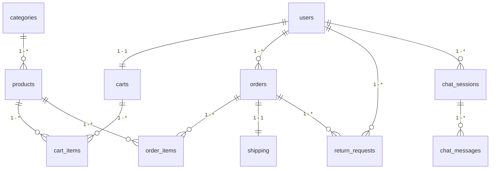

# 🗄️ CƠ SỞ DỮ LIỆU SQLITE HỆ THỐNG E-COMMERCE & ĐỔI TRẢ (DATABASE CONTEXT)

> Tài liệu quy định chi tiết 11 bảng CSDL SQLite, định nghĩa DDL (Data Definition Language), mối quan hệ, các ràng buộc Enums (CHECK constraints) và các câu lệnh SQL mẫu phục vụ cho ReAct Agent tra cứu.

---

## 📐 1. SƠ ĐỒ THỰC THỂ ERD (MERMAID)



---

## 🛠️ 2. SQLite DDL SCHEMA (CÂU LỆNH TẠO BẢNG CHUẨN SQLITE)

```sql
-- ========================================================
-- CSDL SQLITE HỆ THỐNG TRA CỨU ĐƠN HÀNG & ĐỔI TRẢ (11 BẢNG)
-- ========================================================

-- 1. Bảng Khách hàng / Người dùng
CREATE TABLE IF NOT EXISTS users (
    id INTEGER PRIMARY KEY AUTOINCREMENT,
    full_name TEXT NOT NULL,
    email TEXT UNIQUE NOT NULL,
    password TEXT NOT NULL,
    phone TEXT,
    role TEXT CHECK(role IN ('CUSTOMER', 'ADMIN', 'STAFF')) DEFAULT 'CUSTOMER',
    created_at TIMESTAMP DEFAULT CURRENT_TIMESTAMP
);

-- 2. Bảng Danh mục sản phẩm
CREATE TABLE IF NOT EXISTS categories (
    id INTEGER PRIMARY KEY AUTOINCREMENT,
    name TEXT NOT NULL,
    description TEXT
);

-- 3. Bảng Sản phẩm
CREATE TABLE IF NOT EXISTS products (
    id INTEGER PRIMARY KEY AUTOINCREMENT,
    category_id INTEGER REFERENCES categories(id) ON DELETE SET NULL,
    name TEXT NOT NULL,
    description TEXT,
    price REAL NOT NULL,
    stock INTEGER DEFAULT 0,
    image_url TEXT,
    status TEXT CHECK(status IN ('ACTIVE', 'INACTIVE', 'OUT_OF_STOCK')) DEFAULT 'ACTIVE'
);

-- 4. Bảng Giỏ hàng
CREATE TABLE IF NOT EXISTS carts (
    id INTEGER PRIMARY KEY AUTOINCREMENT,
    user_id INTEGER UNIQUE REFERENCES users(id) ON DELETE CASCADE,
    created_at TIMESTAMP DEFAULT CURRENT_TIMESTAMP
);

-- 5. Bảng Chi tiết giỏ hàng
CREATE TABLE IF NOT EXISTS cart_items (
    id INTEGER PRIMARY KEY AUTOINCREMENT,
    cart_id INTEGER REFERENCES carts(id) ON DELETE CASCADE,
    product_id INTEGER REFERENCES products(id) ON DELETE CASCADE,
    quantity INTEGER DEFAULT 1,
    price REAL NOT NULL
);

-- 6. Bảng Đơn hàng
CREATE TABLE IF NOT EXISTS orders (
    id INTEGER PRIMARY KEY AUTOINCREMENT,
    user_id INTEGER REFERENCES users(id) ON DELETE CASCADE,
    order_code TEXT UNIQUE NOT NULL,
    total_amount REAL NOT NULL,
    shipping_fee REAL DEFAULT 0,
    status TEXT CHECK(status IN ('PENDING', 'CONFIRMED', 'PACKING', 'SHIPPING', 'DELIVERED', 'CANCELLED')) DEFAULT 'PENDING',
    payment_method TEXT,
    shipping_address TEXT,
    created_at TIMESTAMP DEFAULT CURRENT_TIMESTAMP,
    updated_at TIMESTAMP DEFAULT CURRENT_TIMESTAMP
);

-- 7. Bảng Chi tiết đơn hàng
CREATE TABLE IF NOT EXISTS order_items (
    id INTEGER PRIMARY KEY AUTOINCREMENT,
    order_id INTEGER REFERENCES orders(id) ON DELETE CASCADE,
    product_id INTEGER REFERENCES products(id) ON DELETE RESTRICT,
    quantity INTEGER DEFAULT 1,
    unit_price REAL NOT NULL
);

-- 8. Bảng Vận chuyển (Shipping)
CREATE TABLE IF NOT EXISTS shipping (
    id INTEGER PRIMARY KEY AUTOINCREMENT,
    order_id INTEGER UNIQUE REFERENCES orders(id) ON DELETE CASCADE,
    carrier TEXT NOT NULL,
    tracking_number TEXT UNIQUE NOT NULL,
    status TEXT CHECK(status IN ('CREATED', 'PICKED_UP', 'IN_TRANSIT', 'DELIVERED', 'FAILED')) DEFAULT 'CREATED',
    estimated_delivery TIMESTAMP,
    delivered_at TIMESTAMP
);

-- 9. Bảng Yêu cầu đổi trả (ReturnRequest)
CREATE TABLE IF NOT EXISTS return_requests (
    id INTEGER PRIMARY KEY AUTOINCREMENT,
    return_code TEXT UNIQUE NOT NULL,
    order_id INTEGER REFERENCES orders(id) ON DELETE CASCADE,
    user_id INTEGER REFERENCES users(id) ON DELETE CASCADE,
    reason TEXT CHECK(reason IN ('DEFECTIVE', 'WRONG_ITEM', 'DAMAGED', 'MIND_CHANGE')) NOT NULL,
    description TEXT,
    status TEXT CHECK(status IN ('REQUESTED', 'REVIEWING', 'APPROVED', 'REJECTED', 'RETURNING', 'COMPLETED', 'CANCELLED')) DEFAULT 'REQUESTED',
    image_url TEXT,
    created_at TIMESTAMP DEFAULT CURRENT_TIMESTAMP,
    updated_at TIMESTAMP DEFAULT CURRENT_TIMESTAMP
);

-- 10. Bảng Phiên trò chuyện AI
CREATE TABLE IF NOT EXISTS chat_sessions (
    id INTEGER PRIMARY KEY AUTOINCREMENT,
    user_id INTEGER REFERENCES users(id) ON DELETE CASCADE,
    created_at TIMESTAMP DEFAULT CURRENT_TIMESTAMP,
    updated_at TIMESTAMP DEFAULT CURRENT_TIMESTAMP
);

-- 11. Bảng Tin nhắn hội thoại
CREATE TABLE IF NOT EXISTS chat_messages (
    id INTEGER PRIMARY KEY AUTOINCREMENT,
    session_id INTEGER REFERENCES chat_sessions(id) ON DELETE CASCADE,
    role TEXT CHECK(role IN ('USER', 'ASSISTANT', 'SYSTEM')) NOT NULL,
    message TEXT NOT NULL,
    created_at TIMESTAMP DEFAULT CURRENT_TIMESTAMP
);

-- TẠO INDEXES TRUY VẤN NHAH CHO AGENT
CREATE INDEX IF NOT EXISTS idx_orders_code ON orders(order_code);
CREATE INDEX IF NOT EXISTS idx_orders_user ON orders(user_id);
CREATE INDEX IF NOT EXISTS idx_shipping_order ON shipping(order_id);
CREATE INDEX IF NOT EXISTS idx_returns_order ON return_requests(order_id);
```

---

## 📝 3. DỮ LIỆU MẪU THỬ NGHIỆM (SEED DATA SQL)

```sql
-- Chèn Khách hàng mẫu
INSERT INTO users (id, full_name, email, password, phone, role) VALUES
(1, 'Nguyễn Văn A', 'nguyenvana@gmail.com', 'hashed_pass_1', '0987654321', 'CUSTOMER'),
(2, 'Trần Thị B', 'tranthib@gmail.com', 'hashed_pass_2', '0912345678', 'CUSTOMER');

-- Chèn Danh mục & Sản phẩm mẫu
INSERT INTO categories (id, name, description) VALUES (1, 'Thời trang Nam', 'Quần áo nam cao cấp');
INSERT INTO products (id, category_id, name, description, price, stock, status) VALUES
(101, 1, 'Áo Polo Nam Premium', 'Chất liệu thun CVC thoáng mát', 610000, 45, 'ACTIVE'),
(102, 1, 'Tai nghe Bluetooth Noise Cancelling', 'Khử tiếng ồn chủ động', 3500000, 12, 'ACTIVE'),
(103, 1, 'Giày Sneaker Thể Thao', 'Đế cao su êm ái', 890000, 0, 'OUT_OF_STOCK');

-- Chèn Đơn hàng ORD-8899 (Hợp lệ đổi trả - Giao cách đây 3 ngày)
INSERT INTO orders (id, user_id, order_code, total_amount, shipping_fee, status, payment_method, shipping_address, created_at) VALUES
(1, 1, 'ORD-8899', 1250000, 30000, 'DELIVERED', 'COD', '123 Nguyễn Huệ, Quận 1, TP.HCM', datetime('now', '-5 days'));

INSERT INTO order_items (order_id, product_id, quantity, unit_price) VALUES (1, 101, 2, 610000);

INSERT INTO shipping (order_id, carrier, tracking_number, status, estimated_delivery, delivered_at) VALUES
(1, 'Giao Hàng Nhanh (GHN)', 'GHN88992211', 'DELIVERED', datetime('now', '-4 days'), datetime('now', '-3 days'));

-- Chèn Đơn hàng ORD-1024 (Quá hạn 7 ngày - Giao cách đây 15 ngày)
INSERT INTO orders (id, user_id, order_code, total_amount, shipping_fee, status, payment_method, shipping_address, created_at) VALUES
(2, 1, 'ORD-1024', 3500000, 0, 'DELIVERED', 'VNPAY', '456 Lê Lợi, Quận 1, TP.HCM', datetime('now', '-18 days'));

INSERT INTO order_items (order_id, product_id, quantity, unit_price) VALUES (2, 102, 1, 3500000);

INSERT INTO shipping (order_id, carrier, tracking_number, status, estimated_delivery, delivered_at) VALUES
(2, 'Giao Hàng Tiết Kiệm (GHTK)', 'GHTK102499', 'DELIVERED', datetime('now', '-16 days'), datetime('now', '-15 days'));

-- Chèn Đơn hàng ORD-5500 (Đang chờ - Hủy được)
INSERT INTO orders (id, user_id, order_code, total_amount, shipping_fee, status, payment_method, shipping_address, created_at) VALUES
(3, 2, 'ORD-5500', 890000, 30000, 'PENDING', 'COD', '789 Điện Biên Phủ, Bình Thạnh, TP.HCM', datetime('now', '-1 hours'));

INSERT INTO order_items (order_id, product_id, quantity, unit_price) VALUES (3, 103, 1, 890000);

INSERT INTO shipping (order_id, carrier, tracking_number, status) VALUES
(3, 'Viettel Post', 'VT55001122', 'CREATED');
```

---

## 🔍 4. CÁC CÂU LỆNH SQL THƯỜNG DÙNG TRONG TOOLS (`sqlite3`)

### 1. Truy vấn chi tiết đơn hàng (`get_order_details`)
```sql
SELECT o.order_code, o.status, o.total_amount, o.payment_method, o.shipping_address, o.created_at,
       GROUP_CONCAT(p.name || ' (x' || oi.quantity || ')', ', ') AS items
FROM orders o
JOIN order_items oi ON o.id = oi.order_id
JOIN products p ON oi.product_id = p.id
WHERE o.order_code = ?
GROUP BY o.id;
```

### 2. Kiểm tra điều kiện 7 ngày đổi trả (`check_return_eligibility`)
```sql
SELECT o.order_code, o.status AS order_status, s.status AS shipping_status, s.delivered_at,
       CAST((julianday('now') - julianday(s.delivered_at)) AS INTEGER) AS days_since_delivery
FROM orders o
JOIN shipping s ON o.id = s.order_id
WHERE o.order_code = ?;
```

### 3. Tạo yêu cầu đổi trả (`create_return_request`)
```sql
INSERT INTO return_requests (return_code, order_id, user_id, reason, description, status)
VALUES (?, (SELECT id FROM orders WHERE order_code = ?), ?, ?, ?, 'REQUESTED');
```
