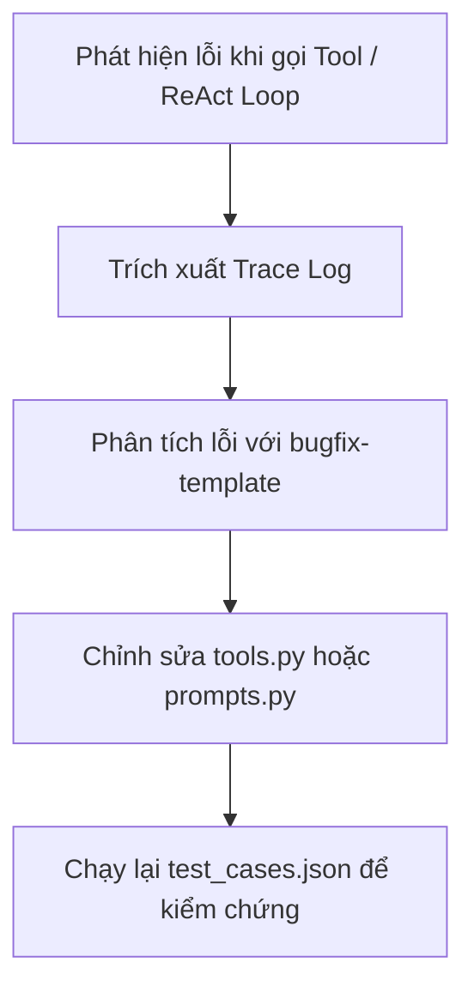

# 🔄 WORKFLOW: BUGFIX FLOW

```mermaid
flowchart TD
    A[Phát hiện lỗi khi gọi Tool / ReAct Loop] --> B[Trích xuất Trace Log]
    B --> C[Phân tích lỗi với bugfix-template]
    C --> D[Chỉnh sửa tools.py hoặc prompts.py]
    D --> E[Chạy lại test_cases.json để kiểm chứng]
```
